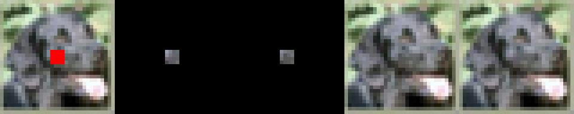
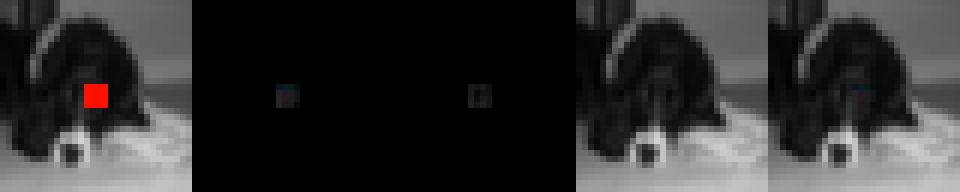

# *Redacto*
A neural network designed to un-redact images.

# Abstracto

We created a deep neural network to reconstruct images from the CIFAR dataset where a portion has been redacted. We used a convolutional model with 3 layers, ReLU, and a special redacted channel inserted at each layer so the network can always easily tell which pixels in the image are not redacted and what portion of the image it needs to focus on recreating. We calculated loss only over the redaction portion of the predicted image and actual target. We were able to produce some convincing constructions.

# Problemo
We are trying to do image reconstruction. We want to take images, remove a portion of the image, and have our deep neural network reconstruct that portion of the image as close to the original as possible.

# Inspirationo/Relato Worko
We were mostly inspired from the work we did with CIFAR and Imagenet in class, and wanted to expand on that. One other inspiration was from machine learning in a previous quarter, where we were assigned MINST classification. We figured out that you could construct digits by multiplying by the *inverse* of the classification matrix. So we wanted to do something in that vein - except this time reconstruct images.

We used a modified CIFAR dataset with the centers of each image removed. 

# Methodos
The model we created was a 3 layer convolutional neural network with ReLU in between the layers. However, we also insert the redact channel (4th/alpha channel) from the initial image into every layer except the last one. This improves network performance significantly (reduces loss by about 25%). Visually, it looks way more than ~25% better.

# Experimentos

We do MSE loss over the redacted region of the prediction image and the target image. We also visually evaluate the results - we're trying to produce images such that people can't tell the difference.

# Resultos
In the end, our test loss was 0.0100, and our train loss was 0.010911520. Visually, we can produce quite convincing reconstructions:

The images are, in order from left to right, the input we give to the model (redacted image), the prediction (cropped down to the relevant portion - the region that was redacted in the original image), the original (cropped down to the relavant portion), the original (full image), and the reconstruction (prediction pasted over observation). 

to the point where sometimes it's hard to tell which is the generated image and which is the original. We have some less convincing generations, particularly on images where the subject is black and white:

sometimes it appears to generate color in cases where it should just generate black and white. It also seems biased towards creating purples and greens where it shouldn't. I believe this is because cifar is dominated by greens/purples because of all the animals and natural backgrounds in the dataset. We could fix this by adding more black and white images to the dataset. 

# Futuro
Training this neural network on higher resolution images would be an interesting challenge and logical next step. We did not attempt this because training was already slow on the 32 x 32 CIFAR images, and so training on much larger images would require more compute power or more clever tricks to speed up training. Another logical next step would be to allow you to redact portions of an image on a pixel-by-pixel basis and then have the neural net predict all those pixels.

# Video
