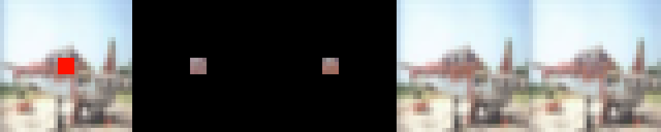
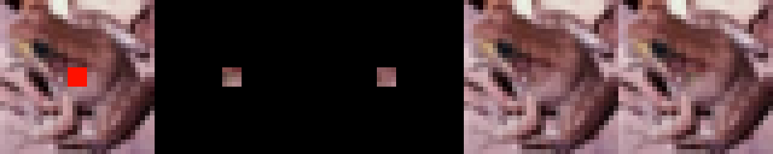

# *Redacto*
A neural network designed to un-redact images.

By Shiven Bhatt and Ethan Fisher

# Abstracto

We created a deep neural network to reconstruct images from the CIFAR dataset where a portion has been redacted. We used a convolutional model with 3 layers, ReLU, and a special redacted channel inserted at each layer so the network can always easily tell which pixels in the image are not redacted and what portion of the image it needs to focus on recreating. We calculated loss only over the redaction portion of the predicted image and actual target. We were able to produce some convincing constructions.


# Problemo
We are trying to do image reconstruction. We want to take images, remove a portion of the image, and have our deep neural network reconstruct that portion of the image as close to the original as possible. It is, of course, impossible to actually replicate the image 1 to 1 (we are removing information from the image - you can't create information!). But with this project, we are trying to see how good we can make the generations, and if we can make them convincing to a human observer. 

# Inspirationo/Relato Worko
We were mostly inspired from the work we did with CIFAR and Imagenet in class, and wanted to expand on that. One other inspiration was from machine learning in a previous quarter, where we were assigned MINST classification. We figured out that you could construct digits by multiplying by the *inverse* of the classification matrix. So we wanted to do something in that vein - except this time reconstruct images instead of digits. 

# Dataseto
We used a modified CIFAR dataset, with the middle of the image 'redacted'. What this means is we construct a new image where the center 4x4 pixels are converted to the color grey instead of being whatever color they were in the original image, and a 4th channel (the redact channel) is added to the image, which contains information about which pixels have been 'redacted' (greyed out). This 4th channel is 1.0 for every pixel that was redacted, and 0.0 for every pixel that was not. In essence, if the original looks like this:


The redacted image looks like this:


You can imagine in tensors what this looks like - consider the following to be the red channel of an image:
```
tensor([[0.5, 0.1, 0.2, 0.3]
        [0.6, 0.2, 0.4, 0.9]
        [0.1, 0.1, 0.5, 0.5]
        [0.1, 0.2, 0.3, 0.4]])
```

this is what it looks like post redaction:
```
tensor([[0.5, 0.1, 0.2, 0.3]
        [0.6, 0.5, 0.5, 0.9]
        [0.1, 0.5, 0.5, 0.5]
        [0.1, 0.2, 0.3, 0.4]])
```

and this is what the new 'redact' channel looks like.

```
tensor([[0.0, 0.0, 0.0, 0.0]
        [0.0, 1.0, 1.0, 0.0]
        [0.0, 1.0, 1.0, 0.0]
        [0.0, 0.0, 0.0, 0.0]])
```

in the above example i'm showing a 2x2 pixel redaction, in our system, we use a 4x4 pixel redaction.

# Methodos
The model we created was a 3 layer convolutional neural network with ReLU in between the layers. However, we also insert the redact channel (4th/alpha channel) from the initial image into every layer except the last one. This improves network performance significantly (reduces loss by about 25%). Visually, it looks way more than ~25% better.

Here's the visualization of our model architecture (where the red lines between layers represent convolution plus ReLU layers):


All of our code for this model is in `final.py`.

# Experimentos
We tried using batch normalization, regularization, downsampling, the Adam optimizer, more layers and channels, and training on the whole data per epoch, but these surprisingly weren't needed and just slowed down our training significantly. What worked was training over the whole data over all the epochs, and inserting the redact channel at each layer. Those two combined provided good results, both visually, and empirically (lower loss). 

# Evaluationo
We do MSE loss over the redacted region of the predicted image and the target image. We also visually evaluate the results - we're trying to produce realistic images such that people can't tell the difference between which one is real and which one is fake.

# Resultos
In the end, our test loss was 0.0100, and our train loss was 0.010911520 (this means that we were not overfitting). Visually, we can produce quite convincing reconstructions:





The images are, in order from left to right, the input we give to the model (redacted image - the red region is the redacted part), the prediction (cropped down to the relevant portion - the region that was redacted in the original image), the original (cropped down to the relavant portion), the original (full image), and the reconstruction (prediction cropped down to the relevant portion pasted over observation). Note that the red is added for the viewer, the actual model trains on images that have been redacted with a gray color. 


to the point where sometimes it's hard to tell which is the generated image and which is the original. We have some less convincing generations, particularly on images where the subject is black and white:


Sometimes it appears to generate color in cases where it should just generate black and white. It also seems biased towards creating purples and greens where it shouldn't. I believe this is because cifar is dominated by greens/purples because of all the animals and natural backgrounds in the dataset. We could fix this by adding more black and white images to the dataset or just using a more diverse dataset than CIFAR.

# Futuro
Training this neural network on higher resolution images would be an interesting challenge and logical next step. We did not attempt this because training was already slow on the 32 x 32 CIFAR images, and so training on much larger images would require more compute power or more clever tricks to speed up training. Another logical next step would be to allow you to redact portions of an image on a pixel-by-pixel basis and then have the neural net predict all those pixels. Since we already make use of the redact channel, our model already has the infastructure to handle this.

# Video
